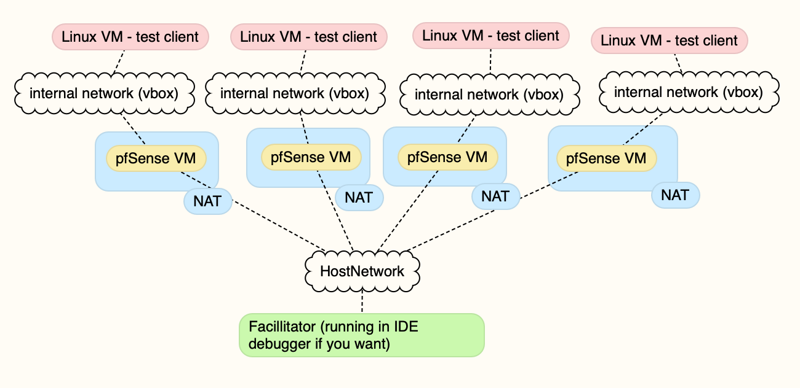

# LiteLibNet NAT Punchthrough for TugBoat / FishNet

NAT punch server based on LiteNetLib for TugBoat/Fishnet use.  Example command line client included for experimentation and testing.

Clients identify as either a game host or a game client and present a token/key that identifies the game they want to join.  The Facillitator introduces them to the server for that game and visa versa and the library punches the holes for p2p.  This does not require either the game server or the game clients to be free of NAT or port forwarded.

Implementing: [STUN/TURN/ICE](https://anyconnect.com/stun-turn-ice/), but without the TURN fallback for now.  Future plans are to [encorporate UPNP](https://github.com/lontivero/Open.NAT) and create a relay server for TURN as well and add fallback with a ICE moderator.

### Dependency
[https://github.com/RevenantX/LiteNetLib](https://github.com/RevenantX/LiteNetLib)
## Proposed Approach

1. <del>Done: Create a standalone NAT Punchthrough Facillitator/Server based on LiteNetLib</del>
1. <del>Done: Create a client for testing</del>
1. <del>Done: Manually test multiple game servers and clients.</del>
	- <del>multiple clients and session keys</del>
	- <del>pass traffic to test punchthrough</del>
1. Create Automated Tests against the punchthrough server that:
	- Test multiple clients
	- Test multiple session keys
	- validate traffic can pass
1. Detect [Symetrical NAT](https://webrtchacks.com/symmetric-nat/) and [warn](https://www.aligrant.com/web/blog/2017-01-05_pfsense_nat_traversal_and_games) - punt to relay directly
1. (investigating) Create a client library that aligns with the TugBoat transport
1. (investigating) Create a Unity project that uses this library
1. (investigation) embed this in TugBoat
1. (investigation) upnp


## Getting started doing dev

The repo is organized as a Solution, with multiple projects.  It should import into any C# IDE without a problem.  The LiteNetLib needs to be added as a source submodule due to differing platform compile flags (at least that is what the docs said).

- After you have cloned the repo you will want to do the following commands in the root of the project to pull in the LiteNetLib.
	- ```git fetch; git submodule init; git submodule update```
- Please .gitignore your IDE poop if you plan on submitting a merge request
- Build however you like building 
	- ```dotnet build``` from the project root works just fine
- Run the Facillitator either in your IDE or via command line
	1. ```cd NATPunchFacillitator```
	1. ```dotnet run NATPunchFacillitator -- <serverPort> <serverAddress>```
	1. *or run with defaults:* ```dotnet run```

- Run the client either in your idea or via command line
	- you must run at least two clients with the same token, one in client mode the other in game server mode, to see the punchthrough conversation happen
	- command line 
		- ```dotnet run NATPunchClient -- <gameToken> <server|client> <optional:serverPort> <optional:serverAddress>```
		- defaults are in the code and may change, run without arguments for defaults
		- The arguements are optionsl, but you must include the arguements in the stated order


## Setting up a multiple NAT network test environment using VirtualBox, Ubuntu Server and pfSense (router software).


You can [set up](https://www.nakivo.com/blog/virtualbox-network-setting-guide/) multiple [VirtualBox](https://www.oracle.com/virtualization/virtualbox/) VMs in linux host / firewall pairs and run your Faccilitator on your regular host to similate things.  You can then make connections from the clients on each of the virtualbox guests behind their NAT router to that facilitator. 

**Note** you can do this with Parallels or VMWare as well, I've tested with Parallels and have switched over to it from virtualbox because it's faster and more stable (but not free). If you use parallels you will likely not be able to installed pfSense until you tell the bootloader to use efi (do the _opposite_ of [these instructions to disable EFI](https://kb.parallels.com/en/122735) - ie enable efi by useing 'vm.bios.efi=1' in the bios boot flag section of boot order config in the vm ).

[Decent Guide to setting up NAT Networks using VirtualBox](https://www.techbeatly.com/how-to-create-and-use-natnetwork-in-virtualbox/)


How I do it with VirtualBox (free):

- use [ubuntu linux server](https://ubuntu.com/download/server) and the command line mode for the clients for testing.
	- create n number of Internal Networks with different network ip blocks
	- create a base disk image [with dotnet](https://docs.microsoft.com/en-us/dotnet/core/install/linux-ubuntu#2204) and base vm to clone
	- clone the git project and compile
		- note: probably best to clone it from your dev machine directly using ssh, so you don't have to push all the incremental changes during testing to the master then pull from there.  but.. you do you.
	- clone the base vm using linked n times.
	- assign a different Internal Network to each of the vms
- Create n number of pfsense community edition (free) vms using the same 'create a base, then linked clones of it' technique.
	- place the LAN interface of the pfsense on one of the private networks and the second WAN interface in bridged mode ( this will assign a independant ip address on your network, which is required for accurate testing.
	- **Important** pfSense is a Symetrical NAT router by default, but it can be configured to not be. [Do so](https://www.aligrant.com/web/blog/2017-01-05_pfsense_nat_traversal_and_games), unless you are testing symetrical nat detection.
	- run tests manually from command line on each of the vms as needed.


	
## Resources:
- [https://github.com/RevenantX/LiteNetLib/blob/master/LibSample/HolePunchServerTest.cs](https://github.com/RevenantX/LiteNetLib/blob/master/LibSample/HolePunchServerTest.cs)
- [https://anyconnect.com/stun-turn-ice/](https://anyconnect.com/stun-turn-ice/)
- [https://mirror-networking.gitbook.io/docs/transports/litenetlib-transport](https://mirror-networking.gitbook.io/docs/transports/litenetlib-transport)
- [https://www.atmosera.com/blog/creating-a-daemon-with-net-core-part-1/](https://www.atmosera.com/blog/creating-a-daemon-with-net-core-part-1/)
- [https://dev.to/deagahelio/getting-started-with-litenetlib-2fok](https://dev.to/deagahelio/getting-started-with-litenetlib-2fok)
